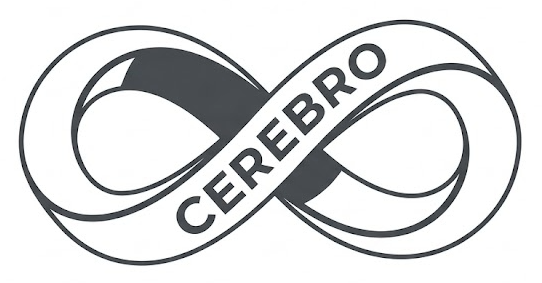

# Cerebro-MCP

<p align="center">
  
</p>

**A Post-Biological Cognitive Architecture for Autonomous AI Agents**

Cerebro-MCP is a custom Model Context Protocol (MCP) server designed to transcend the structural limitations of standard LLM architecture—specifically targeting context-window amnesia, single-threaded processing bottlenecks, and isolated network state.

By acting as a high-velocity "Brain," it provides AI agents with infinite, topologically weighted context scaling, massively parallel data ingestion, strict execution guardrails, and instantaneous global learning ("The Hive Mind").

## The Quantum Advantage: "Seeing the Future"

Standard "Agent Memory" (RAG / Vector Databases) is purely sequential. When a classical AI agent tries to map complex dependencies (e.g., "What happens if I update React, drop a table, and reboot the cluster?"), it must iterate through thousands of historical permutations one-by-one. In massive architectures, the context window explodes, and the agent hallucinates or crashes.

Cerebro uniquely solves this by integrating a **Quantum Coprocessor**. This is meant to facilitate an AI agent's problem-solving skills while supercharging it with slight "see the future" capabilities:
*   **Simultaneous Omniscience (Superposition):** Instead of searching data one row at a time, Cerebro maps architectural variables directly onto Qubits via AWS Braket or IBM Qiskit. The sidecar evaluates *millions* of possible cascading failure scenarios simultaneously in superposition, instantly collapsing to the absolute safest "lowest energy" state before the agent even writes a line of code.
*   **Instantaneous Cascades (Entanglement):** Classical memory treats facts as isolated points requiring linear graph traversal. Quantum memory links dependent microservices and variables via entanglement gates (e.g. `CNOT`). When one variable flips during a simulation, all dependent variables logically shift at the speed of physics, requiring zero compute cycles.

## Documentation

The definitive specifications and architectural blueprints for this project are located in the `/docs` directory:

*   [**The Cerebro Specification (`docs/SPEC.md`)**](./docs/SPEC.md)
    The fundamental philosophy, theoretical guidelines, and original requirements of the post-biological cognitive architecture.
*   [**Implementation Architecture (`docs/ARCH.md`)**](./docs/ARCH.md)
    The concrete engineering blueprint detailing the **Go Primary Engine / Python Tensor Sidecar** polyglot design, the 100% Embedded Database structure, and the multimodal data ingestion pipelines.
*   [**AI Agent Protocol (`docs/SKILL.md`)**](./docs/SKILL.md)
    The strict interactivity guidelines and logical ultimatums. Pass this to any AI connecting to the MCP to force it to adhere to the rigid risk-evaluation invariants.

---

## System Blueprint (The Tripartite Polyglot Core)

The system leverages the strengths of three radically distinct ecosystems communicating via ultra-fast **gRPC**:

1.  **High-Velocity Go Core (`/cmd`, `/internal`)**: Manages the official MCP Server standard I/O streams. Implements the *Thalamic Buffer* for concurrent I/O stream parsing and the *Synthetic Amygdala* to deterministically intercept and deny high-risk execution requests before they happen.
2.  **Cognitive Python Sidecar (`/sidecars/PythonSidecar`)**: Serves as specialized classical mathematical infrastructure. Mounts an embedded Vector database (`ChromaDB`) to form the *Federated Neocortical Matrix* and runs multi-dimensional tensor modeling to calculate execution probabilities.
3.  **Quantum Coprocessor (`/sidecars/QuantumSidecar`)**: Transcends classical compute limits for impossibly dense combinatorial risk topologies (e.g. cascading failure states of an entire datacenter rebuild). Utilizes **IBM Qiskit** and **AWS Braket** to map massive graph variables into qubit superpositions, physically collapsing probabilities to find the lowest-energy risk path instantly.


## Development & Bootstrapping

To hack on the Cerebro-MCP core, you will need **Go 1.22+** and **Python 3.10+** installed on your system.

### 1. Generating Protobuf Bindings

Whenever changes are made to the `proto/cerebro.proto` file, regenerate the bindings linking the Go Core and Python Sidecar:

```bash
# Generate Go bindings
protoc --go_out=. --go-grpc_out=. proto/cerebro.proto

# Generate Python bindings
python -m grpc_tools.protoc -I./proto --python_out=./sidecars/PythonSidecar --grpc_python_out=./sidecars/PythonSidecar proto/cerebro.proto
python -m grpc_tools.protoc -I./proto --python_out=./sidecars/QuantumSidecar --grpc_python_out=./sidecars/QuantumSidecar proto/cerebro.proto
```

### 2. Running The Sub-Cores (Python & Quantum)

The dual sidecars must be active to handle tensor math, embedded search, and circuit mappings.

```bash
# Start Classical Tensor Pipeline
cd sidecars/PythonSidecar
pip install -r requirements.txt
python server.py

# In a new terminal: Start Quantum Coprocessor
cd sidecars/QuantumSidecar
pip install -r requirements.txt
python server.py
# (Note: Export QUANTUM_PROVIDER="AWS_BRAKET" to switch from local simulator to actual hardware)
```

### 3. Compiling the Go Core

```bash
go mod tidy
go build -o bin/cerebro.exe ./cmd/cerebro
```

You can then mount the resulting `cerebro` binary directly into your AI agent's MCP configuration!
